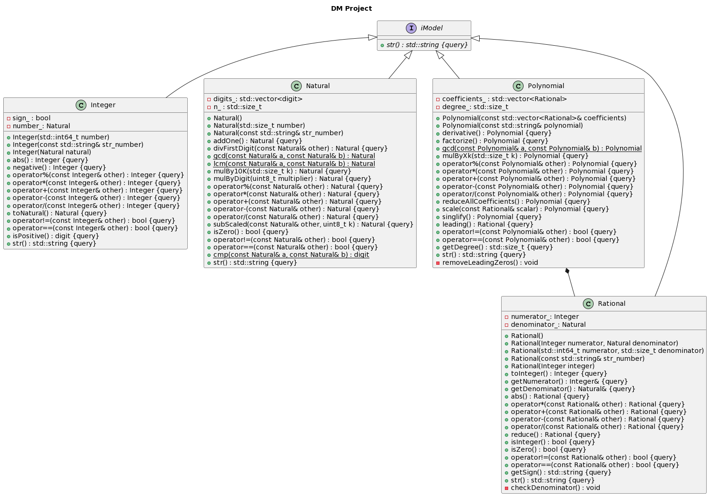

# DM-Project
ETU 2023 DM Project

| Студент           | Код модуля       | Название модуля                        | Название метода                                                                           | Сделано |
|-------------------|------------------|----------------------------------------|-------------------------------------------------------------------------------------------|:-------:|
| Арсений Гурков    | N1, N2, Z1       | COM_NN_D, NZER_N_B, ABS_Z_N            | Natural::cmp,  Natural::isZero,  Integer::abs                                       |         |
| Станислав Цыгулев | N3, N5, Z3       | ADD_1N_N, SUB_NN_N,  MUL_ZM_Z          | Natural::addOne, Natural::operator-,   Integer::negative                               |         |
| Илья Иваницкий    | N4, N8, N11      | ADD_NN_N, MUL_NN_N, DIV_NN_N           | Natural::operator+, Natural::operator*, Natural::operator/                                |    ✓?   |
| Ваня Борисов П.   | N6, N9, N12      | MUL_ND_N, SUB_NDN_N, MOD_NN_N          | Natural::mulByDigit,  Natural::subScaled,  Natural::operator%                             |         |
| Юля Лавренова     | Z2, Z8, Q3       | POZ_Z_D, MUL_ZZ_Z, TRANS_Z_Q           | Integer::isPositive, Integer::operator*, Rational::Rational(const Integer &)              |    ✓?   |
| Роман Цыганков    | Z4, Z7, P4       | TRANS_N_Z, SUB_ZZ_Z, MUL_Pxk_P         | Integer::Integer(const Natural &), Integer::operator-, Polynomial::mulByXk                |         |
| Катя Соц          | Z5, Z9, N13      | TRANS_Z_N, DIV_ZZ_Z, GCF_NN_N          | Integer::toNatural, Integer::operator/,   Natural::gcd                                 |         |
| Алина Валеева     | Q1, Z6, Q7       | RED_Q_Q, ADD_ZZ_Z, MUL_QQ_Q            | Rational::reduce, Integer::operator+, Rational::operator*                                 |         |
| Рома Дамакин      | Q2, Q6, P8, N10  | INT_Q_B, SUB_QQ_Q, MUL_PP_P, DIV_NN_Dk | Rational::isInteger, Rational::operator-, Polynomial::operator*,  Natural::divFirstDigit  |   ✓?    |
| Ярослав Борматов  | Q4, P7, P13      | TRANS_Q_Z, FAC_P_Q, NMR_P_P            | Rational::toInteger, Polynomial::factorize, Polynomial::singlify                          |         |
| Егор Кузьминых    | P1, Q5, P9, P12  | ADD_PP_P, ADD_QQ_Q, DIV_PP_P, DER_P_P  | Polynomial::operator+, Rational::operator+, Polynomial::operator/, Polynomial::derivative |         |
| Антон Жданов      | P3, P6, P11      | MUL_PQ_P, DEG_P_N, GCF_PP_P            | Polynomial::scale, Polynomial::getDegree, Polynomial::gcd                                 |         |
| Паша Ильин        | N7, N14, P2, P10 | MUL_Nk_N, LCM_NN_N, SUB_PP_P, MOD_PP_P | Natural::mulBy10k,  Natural::lcm,   Polynomial::operator-, Polynomial::operator%    |         |
| Мирон Возгрин     | Z10, P5, Q8      | MOD_ZZ_Z, LED_P_Q, DIV_QQ_Q            | Integer::operator%, Rational::leading, Rational::operator/                                |         |

